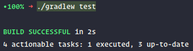
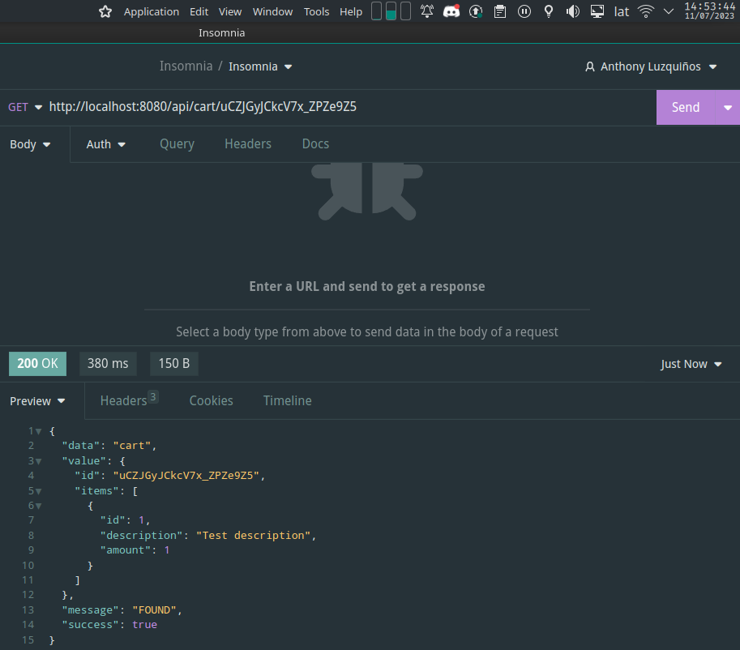
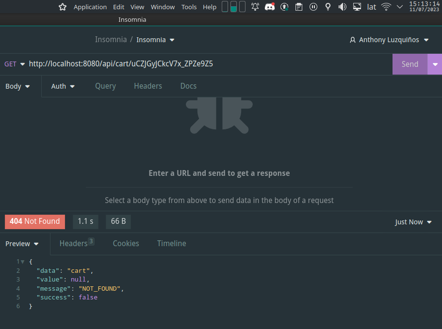

# Ecommerce OneBox

This is a technical test project for OneBox company, which implements an Ecommerce with use cases related to the creation, update, retrieval, and manual/automatic deletion of a shopping cart.
The project is developed using:
 - Spring Boot
 - Lombok
 - MapStruct
 - Redis
 - NanoId

With Java 11 and Gradle +7.6.1 as the main tools.

## Key Features

- Creation of a shopping cart: Users can create a new shopping cart to add products.
- Update of the shopping cart: Users can add or remove products from the existing cart.
- Retrieval of the shopping cart: Users can view the details and contents of the shopping cart.
- Manual deletion: Users can manually delete the shopping cart when no longer needed.
- Automatic deletion: Shopping carts are automatically deleted after 10 minutes of inactivity.

## System Requirements

- Java 11
- Gradle +7.6.1
- Redis (local or remote)

## Project Setup

1. Clone the GitHub repository:

    ```bash
    git clone https://github.com/AnthonyLzq/OneBoxEcommerce
    ```

2. Navigate to the project directory:

    ```bash
    cd OneBoxEcommerce
    ```

3. Build the project:

    ```bash
    ./gradlew build
    ```

4. Run the application:

    The application requires a Redis server to be running. The connection details can be configured using the following environment variables:

    - REDIS_HOST: Hostname or IP address of the Redis server.
    - REDIS_PORT: Port number on which the Redis server is running.
    - REDIS_USER: Username for Redis authentication (if applicable).
    - REDIS_PASSWORD: Password for Redis authentication (if applicable).

    Then run the application using the following command:
    ```bash
    REDIS_HOST=your_redis_host REDIS_PORT=your_redis_port REDIS_USER=your_redis_user REDIS_PASSWORD=your_redis_password ./gradlew bootRun
    ``` 

    Once the application is running, you can access the API at http://localhost:8080/ and get the following output in your terminal:
    ```bash
    2023-07-11 14:20:09.517  INFO 344842 --- [           main] o.a.c.c.C.[Tomcat].[localhost].[/]       : Initializing Spring embedded WebApplicationContext
    2023-07-11 14:20:09.517  INFO 344842 --- [           main] w.s.c.ServletWebServerApplicationContext : Root WebApplicationContext: initialization completed in 659 ms
    2023-07-11 14:20:10.032  INFO 344842 --- [           main] o.s.b.a.e.web.EndpointLinksResolver      : Exposing 1 endpoint(s) beneath base path '/actuator'
    2023-07-11 14:20:10.053  INFO 344842 --- [           main] o.s.b.w.embedded.tomcat.TomcatWebServer  : Tomcat started on port(s): 8080 (http) with context path ''
    2023-07-11 14:20:10.062  INFO 344842 --- [           main] c.xcale.ecommerce.EcommerceApplication   : Started EcommerceApplication in 1.46 seconds (JVM running for 1.679)
    ```

## Testing

The project includes unit tests to ensure the correctness of the implemented functionality.
You can run the tests using the following command:

```bash
./gradlew test
```

Once you run the tests you will and output similar to the following:



## How TTL (Time to Live) Works

When a shopping cart is created, a Redis set command is used to set the TTL to 10 minutes.
This means that the cart will be automatically deleted by Redis after 10 minutes of inactivity.

Every time the shopping cart is interacted with (either by querying or updating it), the TTL is reset.
This ensures that the cart remains active as long as the user is actively using it.
However, if no interactions occur within the 10-minute timeframe, the TTL expires and Redis automatically deletes the cart.

This mechanism helps to clean up and remove unused shopping carts, ensuring efficient use of system resources.

Cart still active:



Cart expired:



## Available Endpoints

- `POST /api/cart`: Creates a new shopping cart and returns it.
- `GET /api/cart/{cartId}`: Retrieves the details and contents of the shopping cart with the specified ID.
- `PATCH /api/cart`: Updates the contents of the shopping cart with the specified ID.
- `DELETE /api/{cartId}`: Manually deletes the shopping cart with the specified ID.

## Project Structure

The project follows a typical package structure of a Spring Boot application:

- `com.onebox.ecommerce`: Root package.
    - `configuration`: Additional application configurations, it contains the Redis configuration.
    - `controller`: REST controllers for API endpoints.
    - `converter`: Converters for mapping between DTOs and DBOs.
    - `dbo`: Database objects used for data access.
    - `dto`: Data transfer objects used in API requests and responses.
    - `repository`:  Repositories for data access.
    - `service`: Application services implementing the business logic.

## Examples

Here are some endpoints you can call:

### Get information about system health, configurations, etc.

```
GET http://localhost:8080/actuator
GET http://localhost:8080/actuator/health
```

### Create a shopping cart

```
POST http://localhost:8080/api/cart
Accept: application/json
Content-Type: application/json

{
    "items": [
        {
            "id": 1,
            "description": "Test description",
            "amount": 1
        }
    ]
}

RESPONSE: HTTP 201 (Created)
{
    "data": "cart",
    "value": {
        "id": "xmnDLtTENUrKiVRc_r1q2",
        "items": [
            {
                "id": 1,
                "description": "Test description",
                "amount": 1
            }
        ]
    },
    "message": "CREATION_SUCCESS",
    "success": true
}
```

### Get shopping cart

```
GET http://localhost:8080/api/cart/xmnDLtTENUrKiVRc_r1q2

RESPONSE: HTTP 200 (OK)
{
    "data": "cart",
    "value": {
        "id": "xmnDLtTENUrKiVRc_r1q2",
        "items": [
            {
                "id": 1,
                "description": "Test description",
                "amount": 1
            }
        ]
    },
    "message": "FOUND",
    "success": true
}
```

### Get shopping cart that no longer exists
```
GET http://localhost:8080/api/cart/QsFCm9qENLfwEl6YtulN-

RESPONSE: HTTP 404 (Not Found)
{
    "data": "cart",
    "value": null,
    "message": "NOT_FOUND",
    "success": false
}
```

### Update shopping cart

```
PATCH http://localhost:8080/api/cart
Accept: application/json
Content-Type: application/json

{
    "id": "xmnDLtTENUrKiVRc_r1q2",
    "items": [
        {
            "id": 2,
            "description": "Test description 2",
            "amount": 2
        }
    ]
}

RESPONSE: HTTP 200 (OK)
{
    "data": "cart",
    "value": {
        "id": "xmnDLtTENUrKiVRc_r1q2",
        "items": [
            {
                "id": 1,
                "description": "Test description",
                "amount": 1
            },
            {
                "id": 2,
                "description": "Test description 2",
                "amount": 2
            }
        ]
    },
    "message": "UPDATE_SUCCESS",
    "success": true
}
```

### Delete a cart

```
DELETE http://localhost:8080/api/cart/xmnDLtTENUrKiVRc_r1q2

RESPONSE: HTTP 200 (OK)
{
    "data": "cart",
    "value": null,
    "message": "DELETION_SUCCESS",
    "success": true
}
```